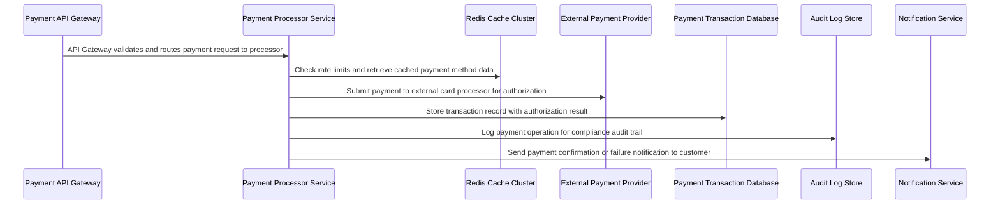

## Details

| Field               | Value                    |
|---------------------|--------------------------|
| **Unique ID**       | credit-card-payment-flow                   |
| **Name**            | Credit Card Payment Processing                 |
| **Description**     | End-to-end flow for processing credit card payments from request to settlement          |

## Sequence Diagram

## Controls
    _No controls defined._

## Metadata
  _No Metadata defined._
