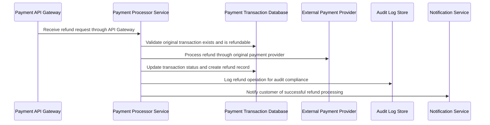

## Details

| Field               | Value                    |
|---------------------|--------------------------|
| **Unique ID**       | refund-processing-flow                   |
| **Name**            | Payment Refund Processing                 |
| **Description**     | Flow for processing payment refunds and reversals          |

## Sequence Diagram

## Controls
    _No controls defined._

## Metadata
  _No Metadata defined._
