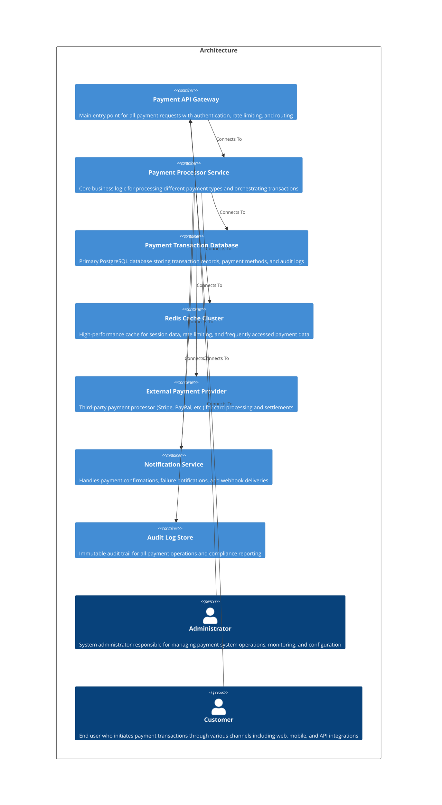

# Welcome to CALM Documentation

This documentation is generated from the **CALM Architecture-as-Code** model.

## High Level Architecture

## Nodes
    - [Payment API Gateway](nodes/payment-api-gateway)
    - [Payment Processor Service](nodes/payment-processor)
    - [Payment Transaction Database](nodes/payment-database)
    - [Redis Cache Cluster](nodes/redis-cache)
    - [External Payment Provider](nodes/external-payment-provider)
    - [Notification Service](nodes/notification-service)
    - [Audit Log Store](nodes/audit-log-store)
    - [Administrator](nodes/administrator)
    - [Customer](nodes/customer)

## Relationships
    - [Gateway To Processor](relationships/gateway-to-processor)
    - [Processor To Database](relationships/processor-to-database)
    - [Processor To Cache](relationships/processor-to-cache)
    - [Processor To External Provider](relationships/processor-to-external-provider)
    - [Processor To Notifications](relationships/processor-to-notifications)
    - [Processor To Audit](relationships/processor-to-audit)
    - [Administrator To Gateway](relationships/administrator-to-gateway)
    - [Customer To Gateway](relationships/customer-to-gateway)

## Flows
    - [Credit Card Payment Processing](flows/credit-card-payment-flow)
    - [Payment Refund Processing](flows/refund-processing-flow)

## Controls
  _No Controls defined._

## Metadata
  

      <table>
          <thead>
          <tr>
              <th>Key</th>
              <th>Value</th>
          </tr>
          </thead>
          <tbody>
          <tr>
              <td>
                  <b>Version</b>
              </td>
              <td>
                  2.1.0
                      </td>
          </tr>
          <tr>
              <td>
                  <b>Owner</b>
              </td>
              <td>
                  Payment Platform Team
                      </td>
          </tr>
          <tr>
              <td>
                  <b>Environment</b>
              </td>
              <td>
                  production
                      </td>
          </tr>
          <tr>
              <td>
                  <b>Compliance</b>
              </td>
              <td>
                  <ul>
                      <li>PCI-DSS</li>
                      <li>SOX</li>
                      <li>GDPR</li>
                  </ul>
              </td>
          </tr>
          <tr>
              <td>
                  <b>Criticality</b>
              </td>
              <td>
                  high
                      </td>
          </tr>
          <tr>
              <td>
                  <b>Last Updated</b>
              </td>
              <td>
                  2025-01-03T10:00:00Z
                      </td>
          </tr>
          <tr>
              <td>
                  <b>Business Unit</b>
              </td>
              <td>
                  Financial Services
                      </td>
          </tr>
          <tr>
              <td>
                  <b>Cost Center</b>
              </td>
              <td>
                  FINTECH-001
                      </td>
          </tr>
          </tbody>
      </table>
  

## Adrs
  _No Adrs defined._
