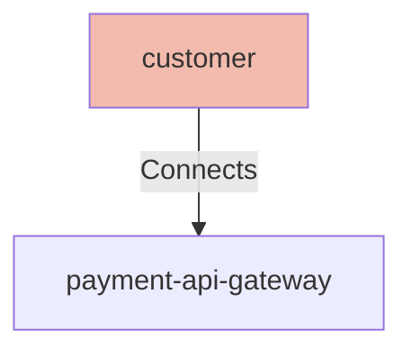

## Details

| Field               | Value                    |
|---------------------|--------------------------|
| **Unique ID**       | customer                   |
| **Node Type**       | actor             |
| **Name**            | Customer                 |
| **Description**     | End user who initiates payment transactions through various channels including web, mobile, and API integrations          |

## Interfaces
        

            <table>
                <thead>
                <tr>
                    <th>Key</th>
                    <th>Value</th>
                </tr>
                </thead>
                <tbody>
                <tr>
                    <td>
                        <b>UniqueId</b>
                    </td>
                    <td>
                        customer-interface
                            </td>
                </tr>
                <tr>
                    <td>
                        <b>AdditionalProperties</b>
                    </td>
                    <td>
                        

                            <table>
                                <thead>
                                <tr>
                                    <th>Key</th>
                                    <th>Value</th>
                                </tr>
                                </thead>
                                <tbody>
                                <tr>
                                    <td>
                                        <b>Url</b>
                                    </td>
                                    <td>
                                        https://api.company.com/payments/v1
                                            </td>
                                </tr>
                                <tr>
                                    <td>
                                        <b>Protocol</b>
                                    </td>
                                    <td>
                                        HTTPS
                                            </td>
                                </tr>
                                </tbody>
                            </table>
                        

                    </td>
                </tr>
                </tbody>
            </table>
        

## Related Nodes

## Controls
    _No controls defined._

## Metadata
  

      <table>
          <thead>
          <tr>
              <th>Key</th>
              <th>Value</th>
          </tr>
          </thead>
          <tbody>
          <tr>
              <td>
                  <b>Role</b>
              </td>
              <td>
                  end-user
                      </td>
          </tr>
          <tr>
              <td>
                  <b>Access Level</b>
              </td>
              <td>
                  standard
                      </td>
          </tr>
          <tr>
              <td>
                  <b>Authentication</b>
              </td>
              <td>
                  oauth2
                      </td>
          </tr>
          </tbody>
      </table>
  

