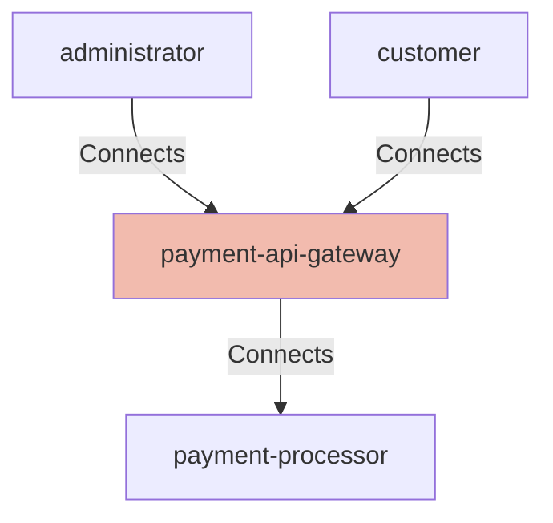

## Details

| Field               | Value                    |
|---------------------|--------------------------|
| **Unique ID**       | payment-api-gateway                   |
| **Node Type**       | service             |
| **Name**            | Payment API Gateway                 |
| **Description**     | Main entry point for all payment requests with authentication, rate limiting, and routing          |

## Interfaces
        

            <table>
                <thead>
                <tr>
                    <th>Key</th>
                    <th>Value</th>
                </tr>
                </thead>
                <tbody>
                <tr>
                    <td>
                        <b>UniqueId</b>
                    </td>
                    <td>
                        payment-gateway-endpoint
                            </td>
                </tr>
                <tr>
                    <td>
                        <b>AdditionalProperties</b>
                    </td>
                    <td>
                        

                            <table>
                                <thead>
                                <tr>
                                    <th>Key</th>
                                    <th>Value</th>
                                </tr>
                                </thead>
                                <tbody>
                                <tr>
                                    <td>
                                        <b>Url</b>
                                    </td>
                                    <td>
                                        https://api.company.com/payments/v1
                                            </td>
                                </tr>
                                <tr>
                                    <td>
                                        <b>Protocol</b>
                                    </td>
                                    <td>
                                        HTTPS
                                            </td>
                                </tr>
                                </tbody>
                            </table>
                        

                    </td>
                </tr>
                </tbody>
            </table>
        

## Related Nodes

## Controls
    _No controls defined._

## Metadata
  

      <table>
          <thead>
          <tr>
              <th>Key</th>
              <th>Value</th>
          </tr>
          </thead>
          <tbody>
          <tr>
              <td>
                  <b>Runtime</b>
              </td>
              <td>
                  Node.js 18
                      </td>
          </tr>
          <tr>
              <td>
                  <b>Framework</b>
              </td>
              <td>
                  Express.js
                      </td>
          </tr>
          <tr>
              <td>
                  <b>Deployment</b>
              </td>
              <td>
                  Kubernetes
                      </td>
          </tr>
          <tr>
              <td>
                  <b>Replicas</b>
              </td>
              <td>
                  3
                      </td>
          </tr>
          </tbody>
      </table>
  

